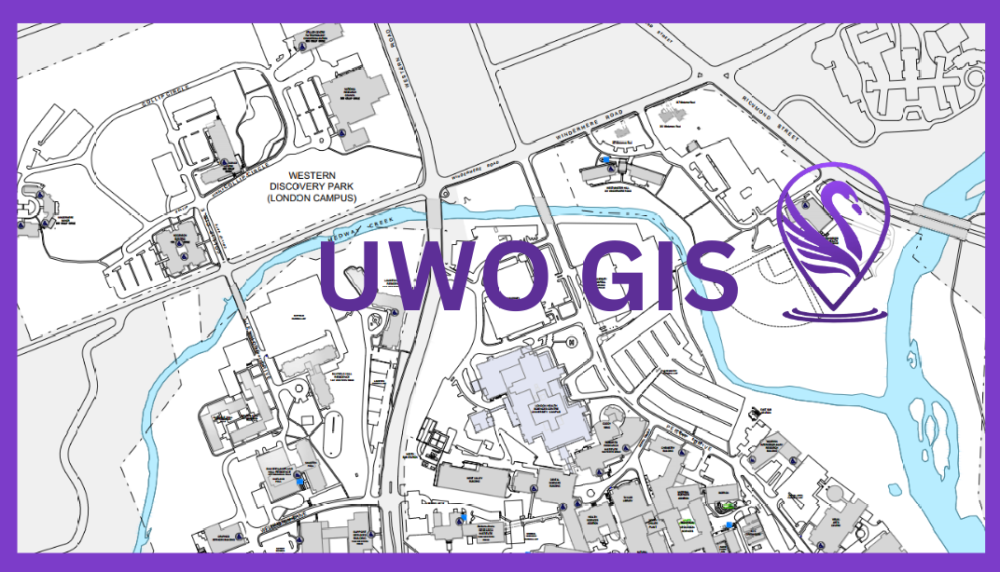
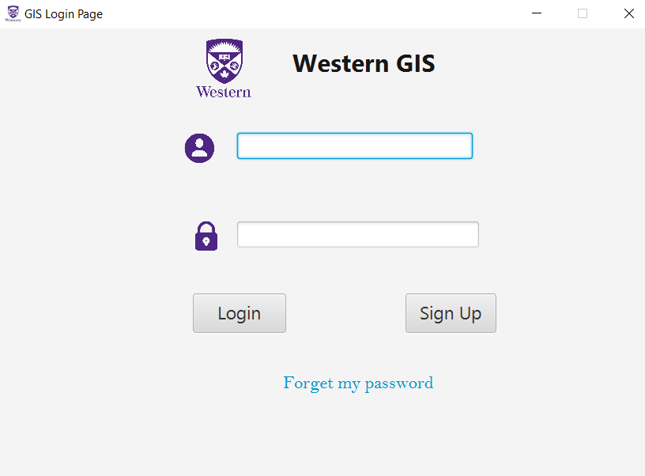
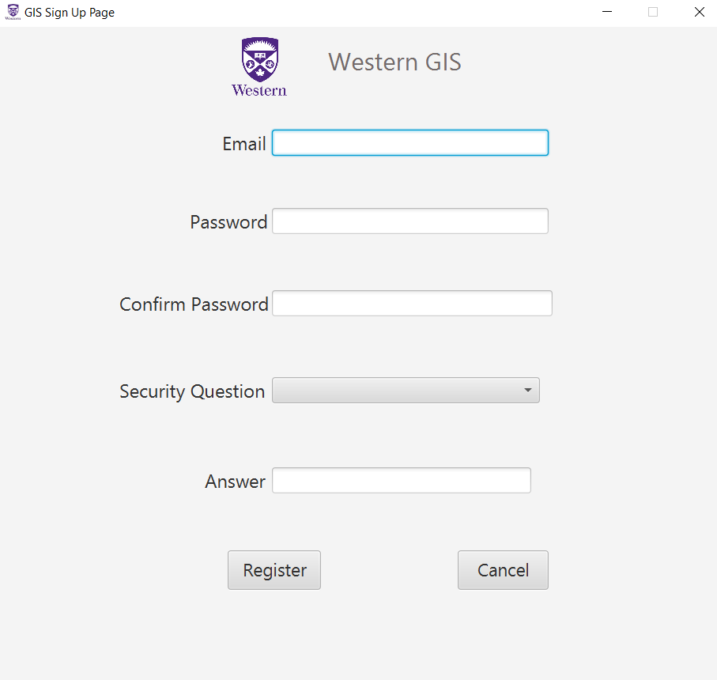
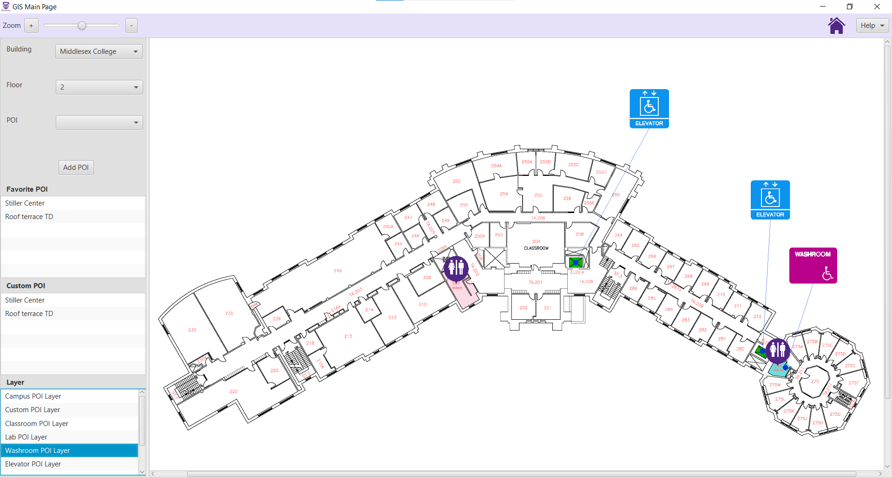

A desktop application in Java for navigating within Western University's campus.

## Project Overview

Getting around a university campus can be difficult, primarily when traditional mapping services need to provide detailed interior layouts. 
At Western University, finding specific locations inside complex buildings can be particularly challenging. The primary purpose of our app is 
to make navigating the campus interiors easier. The app offers quick and efficient navigation within buildings, helping users to locate points 
of interest and reach their destinations quickly. Users can also submit and share their locations, making the app even more valuable and versatile.

## Project members
* Cynthia Du
* Irmene-Valerie Leonard
* John Curran Krupa
* Thai An Luong
* Tyler James Johnson

## Development environment 

* **IDE**

The project involves creating a Java  desktop application, and we used NetBeans IDE 15 to develop it. 

* **Library**

[JavaFX 19.0.1](https://openjfx.io/javadoc/19/): To build the application's GUI.

[JASON-Java](https://stleary.github.io/JSON-java/index.html): User data and the map metadata are stored in JSON files.

[Junit5](https://junit.org/junit5/): For automated tests, especially to verify each unit of the project.

* **Documentation**
To generate API documentation in HTML format for the Java classes of the application, we will use the [Javadoc tool](https://www.oracle.com/technical-resources/articles/java/javadoc-tool.html).

### Project Management
*Confluence* : for project Documenation (UML use cases, UML class diagram, Activity Diagram)

*Jira* : to manage project tasks through a Kanban board

*BitBucket* : to manage and store the project code

*Balsamic Wireframes* : to create the project mockup

## Run the application
To directly run the application, please ensure that Java and JavaFX are installed, and open the command line/prompt from the downloaded application folder (GIS-Maven\target\). 

There, input the runtime command:

```
java -jar --module-path "libs" --add-modules javafx.controls,javafx.fxml GISapp-1.0-SNAPSHOT.jar
```

## Some pages from the application

### Application Login Page


### Application signup page


### Application main page


 

